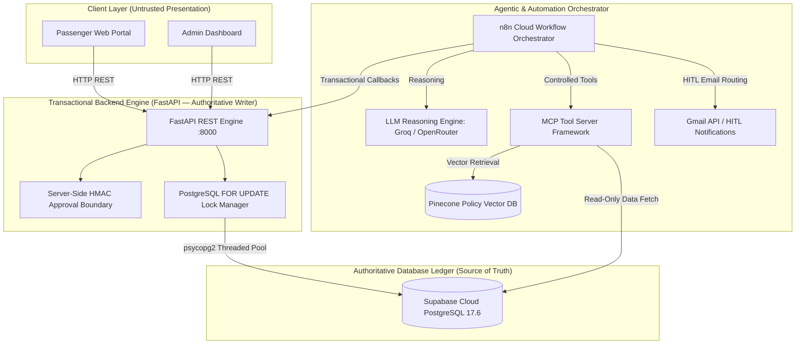

# Flight Management System — Dual-Engine Autonomous Platform

[](#-system-verification--audit-results)
[](#-system-verification--audit-results)
[](#-system-verification--audit-results)
[](#-technology-stack)
[](#-technology-stack)
[](#-technology-stack)
[](#-technology-stack)
[](#-technology-stack)

A production-grade Flight Management System combining a synchronous transactional REST engine (**FastAPI**), a single source of truth database ledger (**Supabase Cloud PostgreSQL 17.6**), an asynchronous workflow and agent orchestrator (**n8n Cloud**), a vector policy search engine (**Pinecone**), and standardized AI tool interfaces (**MCP**).

---

## 🎥 Demo Video

Watch a complete 3-minute walkthrough demonstrating SkyFlow Ops landing page selection, passenger seat holds, booking confirmations, admin ops ledger, HITL refund queue, fraud risk evaluation, and vector RAG policy workbench:

<video src="demo/demo.mp4" controls width="100%"></video>

> 🎬 **[Click here to view / play SkyFlow Ops Demo Video (`demo/demo.mp4`)](demo/demo.mp4)**

---

## 📑 Table of Contents

- [Demo Video](#-demo-video)
- [The Problem](#-the-problem)
- [What We Built](#-what-we-built)
- [Architecture & Data Flow](#-architecture--data-flow)
- [Technology Stack](#-technology-stack)
- [Security & Human Approval Model](#-security--human-approval-model)
- [System Verification & Audit Results](#-system-verification--audit-results)
- [Key Technical Decisions & Trade-offs](#-key-technical-decisions--trade-offs)
- [Local Setup & Quickstart](#-local-setup--quickstart)
- [Demo Instructions](#-demo-instructions)
- [Deployment Preparation](#-deployment-preparation)
- [Known Limitations](#-known-limitations)

---

## 🎯 The Problem

Modern automated travel systems suffer from three major vulnerabilities:

1. **Overselling & Race Conditions**: High-concurrency booking spikes against limited seat capacity cause double-booking and negative inventory.
2. **AI Financial Hallucinations**: Standard LLMs hallucinate refund entitlement amounts, price calculations, and fare policy enforcement.
3. **Untrusted Client Boundaries**: Exposing database keys, API secrets, or HMAC token signing logic to frontend web browsers leads to security bypasses.

---

## 🛠️ What We Built

We designed and built a **Dual-Engine Architecture** that strictly isolates **deterministic transactional authority** from **agentic workflow automation**:

- **FastAPI + Supabase PostgreSQL** is the **sole authoritative transactional writer**. All seat holds, bookings, cancellations, waitlist conversions, and capacity updates use PostgreSQL `FOR UPDATE` row-level locks and schema-level `CHECK` constraints.
- **n8n Cloud** handles asynchronous workflow orchestration, scheduled check-in reminders, price-drop alerts, waitlist promotion callbacks, and supervisor approval routing. n8n **never** directly mutates booking, inventory, or financial state.
- **Pinecone Vector Database** stores policy documents embedded via SentenceTransformers `all-MiniLM-L6-v2` (384 dimensions) for grounded RAG policy answering.
- **Model Context Protocol (MCP)** exposes standardized tools (`get_booking_context`, `query_pinecone_policy`, `calculate_fare_refund_entitlement`, `evaluate_fraud_risk`).
- **Web Frontend SPA** provides interactive Passenger and Admin web portals with zero secrets in the client browser.

---

## 🏛️ Architecture & Data Flow



---

## 💻 Technology Stack

| Layer | Technology | Purpose |
| :--- | :--- | :--- |
| **REST Engine** | Python 3.11, FastAPI 0.110, Uvicorn | Authoritative transactional writer & REST API endpoints. |
| **Database** | Supabase Cloud PostgreSQL 17.6 | Single source of truth ledger with `FOR UPDATE` locks & `CHECK` constraints. |
| **Orchestration** | n8n Cloud | Asynchronous workflows, schedule triggers, and human approval routing. |
| **Vector Search** | Pinecone Serverless (AWS `us-east-1`) | Vector database storing policy document embeddings (`flight-policies`). |
| **Embedding Model**| SentenceTransformers `all-MiniLM-L6-v2` | 384-dimensional policy document vectorization. |
| **AI LLM Models** | Groq (`llama-3.3-70b`), OpenRouter (`nova-lite-v1`) | Agentic reasoning and policy synthesis. |
| **Tool Protocol** | Model Context Protocol (MCP) | Controlled agent tool execution framework (`app/mcp/mcp_tools.py`). |
| **Web Frontend** | Vanilla JavaScript (ES Modules), Glassmorphic CSS | Untrusted client presentation SPA (`http://127.0.0.1:5173`). |
| **Testing** | Playwright, Python `httpx` & `psycopg2` | Automated browser E2E and multi-threaded concurrency suites. |

---

## 🔒 Security & Human Approval Model

1. **Zero Client Secrets**: No database passwords, service role keys, Pinecone API keys, or HMAC signing secrets exist in frontend code or client browser environment variables.
2. **Server-Side HMAC Approval Boundary**: For supervisor refund decisions exceeding $500 threshold, approval tokens are generated and verified exclusively on the FastAPI server boundary (`app/mcp/approval_security.py`).
3. **Deterministic Financial Engine**: Refund entitlement calculations use 100% pure Python/SQL math ($0 LLM financial arithmetic). LLMs are forbidden from calculating money, inventory, or capacity.

---

## 🧪 System Verification & Audit Results

Our system has been verified through automated test suites operating against real running servers:

- **Master System E2E Acceptance Runner (`scratch/master_e2e_acceptance_runner.py`)**:
  - **Score**: **20 / 20 Test Areas PASS (100%)**
  - **Last-Seat Concurrency Race Test**: 10 parallel threads contender for 1 available seat. Exactly 1 thread succeeded (HTTP 201 Created), 9 threads rejected (HTTP 400 Bad Request). Zero overselling (`available_seats = 0`, `booked_seats = 1`).
  - **Dual-Writer Row Lock Serialization**: Competing request blocked for **2649.27 ms** waiting for `FOR UPDATE` transaction commit. Zero lost updates.
- **Playwright Real Browser E2E Suite (`scratch/real_browser_e2e_test.py`)**:
  - **Task 6.1 (Passenger Web Portal)**: **PASS** (Live flight search, seat holds with live `MM:SS` countdown timer, idempotency booking, lookup, cancellation & inventory restoration).
  - **Task 6.2 (Admin & Approval Dashboard)**: **PASS** (Admin flight creation, grounded RAG workbench, `INSUFFICIENT_EVIDENCE` fallback indicators, real-time fraud assessor, HITL refund queue with server-side HMAC boundary, and live audit ledger).
- **Backend Regressions (Phases 3–5)**: **100% PASS**.

---

## ⚖️ Key Technical Decisions & Trade-offs

### Decision 1: FastAPI as Sole Transactional Writer (vs Direct n8n DB Writes)
- **What We Chose**: All state mutations (holds, bookings, cancellations, waitlist promotions) must execute via FastAPI REST endpoints using PostgreSQL `FOR UPDATE` row locks.
- **Why**: Prevents race conditions, dual-writer lock contention, and unvalidated DB state mutations from background bots.
- **Alternative**: Allowing n8n Postgres nodes to directly `UPDATE` seat inventory.
- **Trade-off**: Requires explicit API callback endpoints (`POST /api/v1/bookings/convert-waitlist`), but guarantees 100% transactional safety.

### Decision 2: PostgreSQL Row Locking & Deterministic Transaction Handling ($0 LLM Arithmetic)
- **What We Chose**: Refund eligibility and financial calculations use pure Python/SQL rules evaluating fare class, purchase timing, and departure timeframe under strict database row locks.
- **Why**: LLMs are prone to arithmetic errors and policy hallucinations when calculating financial values.
- **Alternative**: Prompting an LLM to calculate refund amounts directly from policy text.
- **Trade-off**: Requires structured code logic for refund matrix rules, but eliminates financial miscalculations.

### Decision 3: LLM + MCP + Server-Side HMAC Approval Tokens
- **What We Chose**: Supervisor approval tokens are generated and verified on the server side (`POST /api/v1/admin/process-approval`) while n8n orchestrates agent reasoning via MCP tools.
- **Why**: Browsers and client-side JavaScript are untrusted environments. Storing HMAC signing secrets in the browser would allow users to forge supervisor approvals.
- **Alternative**: Signing approval tokens in client-side JavaScript using Vite environment variables.
- **Trade-off**: Requires server-side approval processing endpoints, but ensures zero secret exposure in client code.

---

## 🚀 Local Setup & Quickstart

### Prerequisites
- Python 3.11+
- Git

### 1. Clone & Configure Environment
```bash
git clone https://github.com/your-username/flight-agent-hackathon.git
cd flight-agent-hackathon

# Copy environment template
cp .env.example .env
```
Fill in your Supabase PostgreSQL credentials and Pinecone API key in `.env`.

### 2. Install Dependencies
```bash
pip install -r requirements.txt
python -m playwright install chromium
```

### 3. Launch Application Servers
Start FastAPI Backend (Port 8000):
```bash
python -m uvicorn app.main:app --host 127.0.0.1 --port 8000
```

Start Frontend Static Web Server (Port 5173):
```bash
python -m http.server 5173 --directory frontend
```

Open [http://127.0.0.1:5173](http://127.0.0.1:5173) in your browser.

---

## 🎬 Demo Instructions

- **Demo Video Script**: See [DEMO_SCRIPT.md](DEMO_SCRIPT.md) for a structured 6–8 minute video presentation walkthrough.
- **Pre-Recording Checklist**: See [DEMO_CHECKLIST.md](DEMO_CHECKLIST.md) for operational checks, browser tab setup, and confidentiality rules.

---

## 📦 Deployment Preparation

For complete cloud deployment instructions (Docker, Render, Railway, Vercel, Supabase setup, and CORS configuration), consult [DEPLOYMENT.md](DEPLOYMENT.md).

---

## 📌 Known Limitations

1. **Gmail OAuth Manual Activation**: Gmail OAuth2 credential is configured in n8n Cloud. Real inbox email trigger polling requires a one-time user manual OAuth authorization click in the n8n Cloud UI.
2. **Class-Based Seat Inventory Model**: The backend database models seat capacity by class (`ECONOMY`, `BUSINESS`). Individual graphical seat map selection (e.g. seat 12A, 14B) is not supported by the underlying backend schema and is correctly presented as a class selector in the UI.
3. **Feature-Audit Coverage Matrix**:
   - **PASS**: 45 features (80.4%)
   - **PARTIAL**: 5 features (8.9%)
   - **NOT IMPLEMENTED**: 6 features (10.7% — optional multi-leg routing features)
   - **FAIL**: 0 features (0%)
